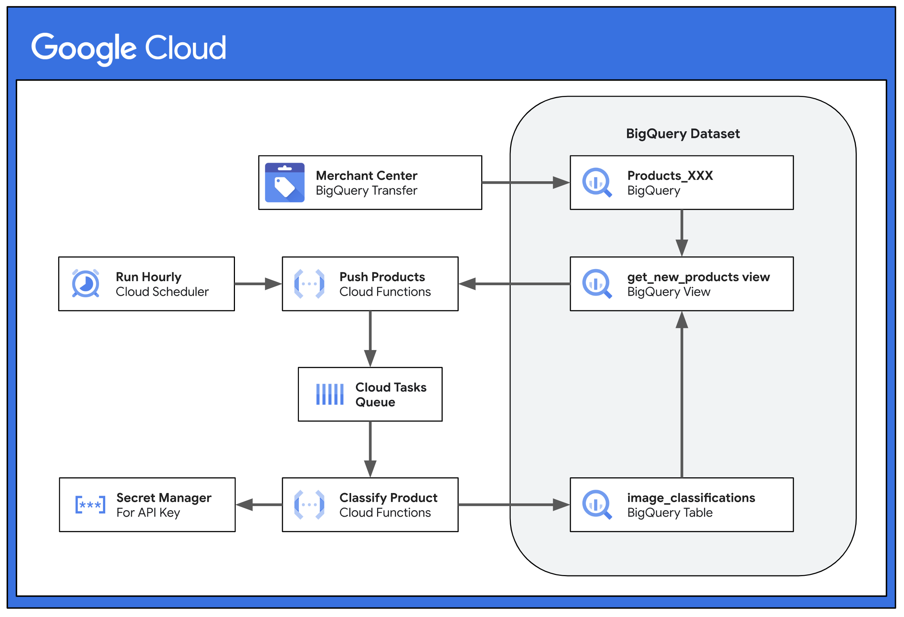

# **Image Inventory**

Automatically classify product images from a Google Merchant Center feed.

## **Overview**

Image Inventory is an open-source solution that utilizes Gemini's multimodal capabilities to automate the classification of product images at scale and with high efficiency.

This solution is designed for easy customization, enabling users to adapt it to a wide range of product image classification tasks. To tailor the solution, users provide a prompt that describes the desired image classifications and define the format of the output data, which is then stored in BigQuery for subsequent use.

## **Features**

* **Gemini API Integration:** Utilizes Gemini's multimodal functionality to classify images based on user-defined text prompts.
* **Google Merchant Center Integration:** Retrieves product data directly from Google Merchant Center via the [Merchant Center BigQuery Transfer](https://cloud.google.com/bigquery/docs/merchant-center-transfer).
* **Cloud-Based Architecture:** Employs Google Cloud services, including Cloud Tasks, to ensure scalability, reliability, and efficient processing.
* **BigQuery Data Storage:** Stores both product data and classification results in BigQuery, providing a centralized repository for analysis.
* **Structured Output:** Enforces structured output to constrain Gemini's generative results, ensuring data consistency and simplifying downstream processing.

## Solution Design



1. On a scheduled basis (every hour by default), the **Push Products** function executes:
   1. Queries **`get_new_products_view`** to get list of unprocessed product images
      1. The view returns the set of product image URLs present in Products_XXX (from the Merchant Center Transfer) and not present in image_classifications (where the solution outputs the classifications)
   2. Pushes new products to the **`classify_products_queue`** in Cloud Tasks
2. Cloud Tasks orchestrates a call to the **Classify Product** function for each product.
3. The **Classify Product** function executes:
   1. Makes HTTP requests to download images from their URLs
   2. Determines image metadata (mime_type, size, and sha256_hash)
   3. Executes multimodal query on Gemini using the prompt & downloaded images as context
   4. Writes returned Gemini classification values & image metadata to BigQuery

## **Installation**

This section outlines the steps to install and configure Image Inventory.

### **Requirements**

To use Image Inventory, you'll need the following:

* A [Google Cloud project](https://console.cloud.google.com) with billing enabled.
* Access to a [Google Merchant Center](https://business.google.com/us/merchant-center/) account.
* [Terraform](https://developer.hashicorp.com/terraform/tutorials/gcp-get-started/install-cli) installed on your local machine or Cloud Shell.
* [Google Cloud SDK (gcloud CLI)](https://cloud.google.com/sdk/docs/install) installed and configured.

Image Inventory uses [Terraform](https://developer.hashicorp.com/terraform/tutorials/gcp-get-started/infrastructure-as-code) to automate the deployment of resources on Google Cloud Platform, streamlining the setup process.

#### **Google Cloud Platform Services and APIs**

>[!IMPORTANT]
>Terraform will automatically enable most of these APIs during the installation.

* **Core Services:**
  * [IAM (Identity and Access Management)](https://cloud.google.com/iam/docs/overview) (iam.googleapis.com)
  * [API Keys](https://cloud.google.com/docs/authentication/api-keys) (apikeys.googleapis.com)
* **Data Storage and Processing:**
  * [BigQuery](https://cloud.google.com/bigquery/docs)
    * bigquery.googleapis.com
    * bigquerydatatransfer.googleapis.com
  * [Cloud Storage](https://cloud.google.com/storage) (storage.googleapis.com)
* **Serverless Compute and Task Management:**
  * [Cloud Run](https://cloud.google.com/run) (for Functions)
    * cloudbuild.googleapis.com
    * cloudfunctions.googleapis.com
    * run.googleapis.com
  * [Cloud Scheduler](https://cloud.google.com/scheduler/docs) (cloudscheduler.googleapis.com)
  * [Cloud Tasks](https://cloud.google.com/tasks/docs) (cloudtasks.googleapis.com)
* **Security and AI:**
  * [Secret Manager](https://cloud.google.com/security/products/secret-manager) (secretmanager.googleapis.com)
  * [Gemini API](https://ai.google.dev/gemini-api/docs) (generativelanguage.googleapis.com)

#### **Service Account**

The solution will create a service account with the following permissions:

* roles/bigquery.dataOwner
* roles/bigquery.jobUser
* roles/cloudtasks.enqueuer
* roles/cloudtasks.viewer
* roles/iam.serviceAccountOpenIdTokenCreator
* roles/iam.serviceAccountUser
* roles/logging.logWriter
* roles/run.invoker
* roles/secretmanager.viewer
* roles/storage.objectViewer

### **Installation Steps**

Follow these steps to install and deploy Image Inventory:

#### **1. Clone the Repository**

Clone the repository using Cloud Shell or your local machine.

#### **2. Configure Classification Logic**

Navigate to the `config/` directory to customize the image classification process.

##### **a. Define Your Classification Prompt (prompt.txt)**

Open the config/prompt.txt file and replace its contents with a clear and specific text prompt that instructs Gemini on how to classify your product images.

* Clearly identify the categories or attributes you want to classify images into.
* Be specific about the visual characteristics that distinguish each category.
* Provide context that will help Gemini understand the product images.

It is highly recommended to start your prompt with the following system instructions:

*You are an image classification expert specializing in product photography. Your task is to analyze a set of images for a given product and classify each image into one of the following categories:*

> [!NOTE]
> Image Inventory will append the product’s title and product type (when available) to the end of the query to provide additional context to Gemini.

The prompt will be executed once per product alongside each unprocessed image associated with the product (image_link and additional_image_links).

##### **b. Define the Output Structure (structured_output.py)**

The config/structured_output.py file defines the LabeledImage Python class, which structures and constrains the generated output. Write your prompt to generate a list of populated LabeledImage classes.

* The following data types are allowed in LabeledImage: str, enum.Enum, int, float, bool, list[AllowedType] (where AllowedType is one of the other allowed types).

* During ```terraform apply```, the python helper function generate_table_schema.py uses the LabeledImage class to generate the schema for the image_classifications output table in BigQuery.

>[!WARNING]
>If you update this class after deploying, you will need to manually delete the generated output table and rerun ```terraform apply```.

#### **3. Enable APIs & Access in your Google Cloud Project**

Before deploying, ensure the following APIs are enabled in your Google Cloud project:

* [Cloud Resource Manager API](https://console.cloud.google.com/apis/library/cloudresourcemanager.googleapis.com) (cloudresourcemanager.googleapis.com)
* [Service Usage API](https://console.cloud.google.com/apis/library/serviceusage.googleapis.com) (serviceusage.googleapis.com)

All other APIs will be enabled automatically by Terraform.

If you are running Terraform as a human user, ensure they have the appropriate BigQuery role (either bigquery.dataOwner or bigquery.dataEditor). If you can't apply this role with project-level access, then complete the instructions until the solution dataset is created (and TF fails), then grant dataset-level access manually and rerun Terraform.

#### **4. Provide Values for Variables**

Create a variables.tfvars file in the terraform/ directory and provide the following values ([click here for details](https://developer.hashicorp.com/terraform/language/values/variables#variable-definitions-tfvars-files)).

| variable | description | required | default |
| :---- | :---- | :---- | :---- |
| project_id | Google Cloud Project ID | required |  |
| service_account | Name of the service account to create. This account will be used to run and manage the solution. ({service_account}@{project_id}.iam.gserviceaccount.com) | required |  |
| merchant_id | Merchant ID or Merchant Aggregator ID (MCA) to use. To find your Merchant Center identifier, log into Merchant Center and look for the number at the top-right corner of the page, above your account email address. | required |  |
| bigquery_dataset_id | Name of the dataset to create in BigQuery where Merchant Center transfer table(s) and output will be stored. | optional | image_inventory |
| bigquery_table_name | Name of the table to create in BigQuery where output will be stored. | optional | image_classifications |
| model_name | [Gemini model variant](https://ai.google.dev/gemini-api/docs/models#model-variations) to use | optional | gemini-2.0-flash |
| location | [Google Cloud region](https://cloud.withgoogle.com/region-picker) to use. | optional | us-central1 |
| product_limit | Number of products to process per batch. | optional | 100 |

**Example terraform/variables.tfvars file:**

```
project_id = "your-gcp-project-id"
service_account = "image-inventory-sa"
merchant_id = "123456789"
bigquery_dataset_id = "my_custom_dataset"
bigquery_table_name = "product_image_labels"
location = "us-central1"
product_limit = 50
```

#### **5. Deploy Image Inventory**

To deploy Image Inventory using Terraform, run the following commands:

> [!WARNING]
> If you are running Terraform using Cloud Shell, you may need to update Terraform to at least v1.11
>
> Follow the [instructions](https://developer.hashicorp.com/terraform/install#linux) (or run this command from the docs below in your terminal.)
>
> ```
> wget -O - <https://apt.releases.hashicorp.com/gpg> | sudo gpg --dearmor -o /usr/share/keyrings/hashicorp-archive-keyring.gpg
> echo "deb [arch=$(dpkg --print-architecture) signed-by=/usr/share/keyrings/hashicorp-archive-keyring.gpg] https://apt.releases.hashicorp.com $(lsb_release -cs) main" | sudo tee /etc/apt/sources.list.d/hashicorp.list
> sudo apt update && sudo apt install terraform
> ```

First, initialize the Terraform configuration:

```terraform init```

Then, apply the Terraform configuration. This will display the changes to be applied and prompt you for confirmation:

```terraform apply -var-file=variables.tfvars```

Type yes and press Enter to confirm the deployment.

> [!IMPORTANT]
> Terraform will try to set up the Merchant Center Transfer using the credentials of the newly created service account. In order to get the transfer to succeed, you will need to either
>
> * Grant the service account with "Performance and insights" access in Merchant Center.
> * Replace the service account with your human user who has access to Merchant Center.
>   * Go to BigQuery > Data Transfers > merchant_center_transfer > Configuration
>   * Click "Update Credentials"
>
> If this is your first time using the Merchant Center Transfer, your ```terraform apply``` might fail with a "table not found" error. It can take up to 24 hours for the Merchant Center transfer table to become available. Once the transfer succeeds and the table exists in BigQuery, run the apply command again.

Once Image Inventory is deployed, you have two options for running the solution:

* **Always On** Go to Cloud Scheduler and enable the scheduled job which will push new products hourly for analysis.
* **Ad-hoc** Open up the [colab notebook](https://colab.research.google.com/github/google-marketing-solutions/image-inventory/blob/main/colab/push_products_adhoc.ipynb) and manually push products to the queue.

Lastly, you will need to enable the newly-created Cloud Scheduler job. Terraform sets the job to PAUSED to prevent the solution from running inadvertently. You can also force a manual run of the job to check if everything is working as expected; look at Cloud Logging or the output BQ table.

## **Destroy Deployed Resources**

To remove all Image Inventory resources from your Google Cloud project, run the following command from the terraform/ directory:

```terraform destroy -var-file=variables.tfvars```

Type yes and press Enter to confirm the deletion of all deployed resources.

## **Contributing**

See the [contributing guidelines](contributing.md) for details on how to contribute to this project.

## **License**

This project is licensed under the Apache 2.0 License.

## **Disclaimer**

This is not an officially supported Google product. This project is not eligible for the [Google Open Source Software Vulnerability Rewards Program](https://bughunters.google.com/open-source-security).
